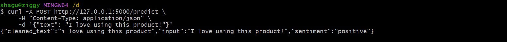
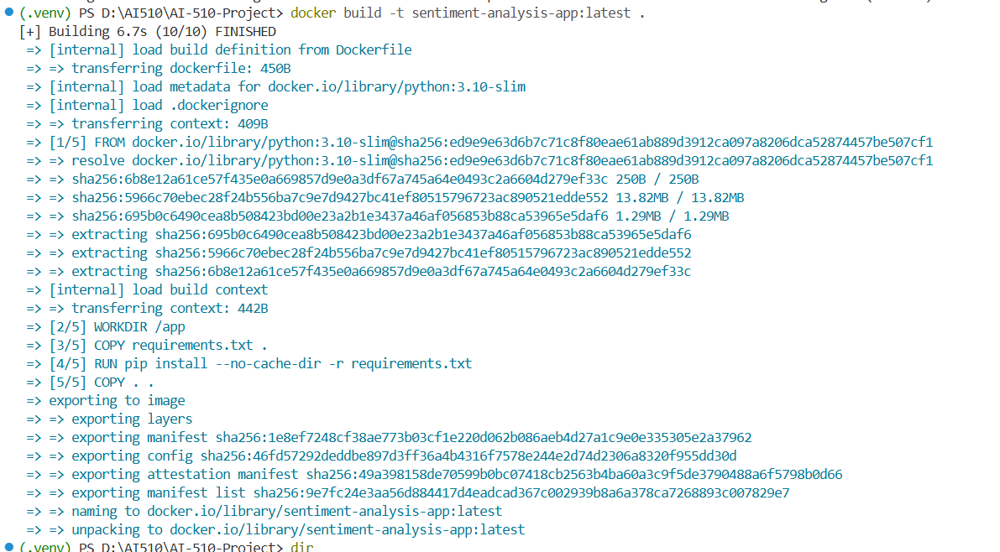
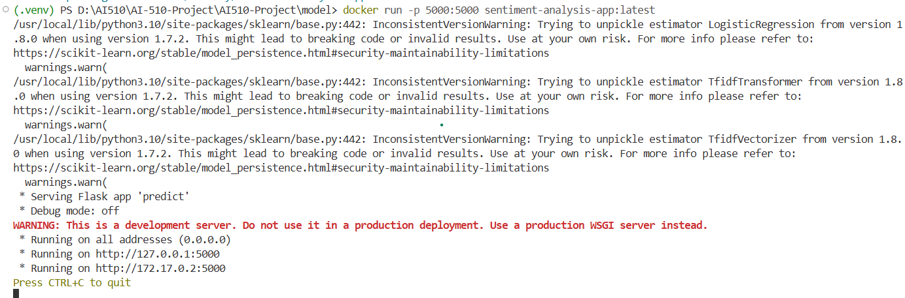
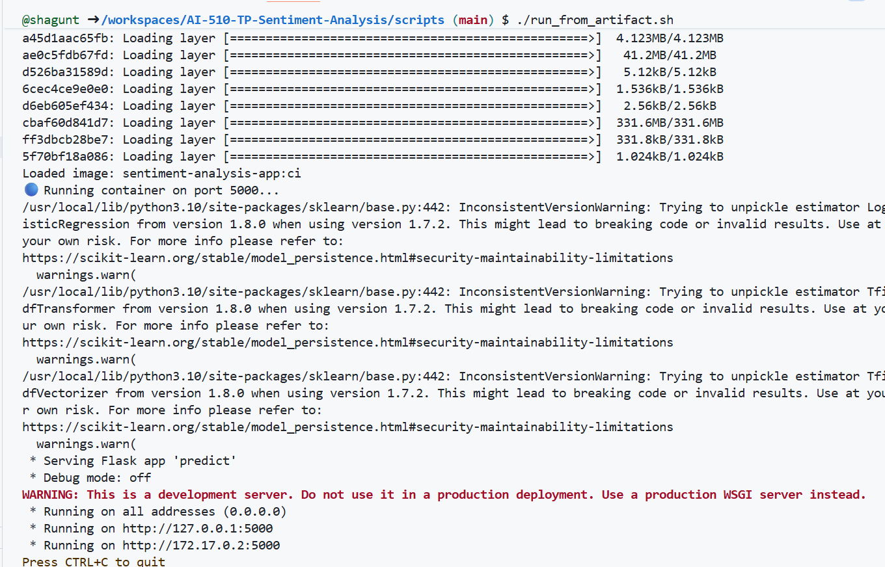

# IA-510-Project
## Model Training Result

The sentiment analysis model was trained using TF-IDF + Logistic Regression.

Accuracy (test set): ~0.84

Artifacts generated:
- TF-IDF vectorizer
- Trained sentiment classification model

## App for predicting sentiment analysis using Flask

curl command to execute POST on predict: 
    ` curl -X POST http://127.0.0.1:5000/predict \
     -H "Content-Type: application/json" \
     -d '{"text": "I love using this product!"}'
{"cleaned_text":"i love using this product","input":"I love using this product!","sentiment":"positive"}
`

## DockerFile Image generation:
Command to build :
` docker build -t sentiment-analysis-app:latest .`

Expect an output if build locally:

## Docker run locally before pushing it to GHCR
command to start container:
`docker run -p 5000:5000 sentiment-analysis-app:latest`
Run output:

Test predict path on running container app:
command:
`$ curl -X POST http://localhost:5000/predict -H "Content-Type: application/json" -d "{\"text\": \"I love this product\"}"
`

## 🖼️ Running the API from Artifact in Codespaces

The screenshot below shows the Docker image being loaded from the CI/CD artifact and the Flask API starting successfully inside GitHub Codespaces.

The output demonstrates:

- Docker layers loading from `sentiment-image.tar`
- The image `sentiment-analysis-app:ci` being loaded
- The container starting on port **5000**
- Flask booting inside the container
- scikit‑learn version warnings (expected when model was trained with a different version)
- The API running and ready to accept requests

Once the container is running, Codespaces automatically forwards port **5000**, allowing the UI to call the API using a URL like:
